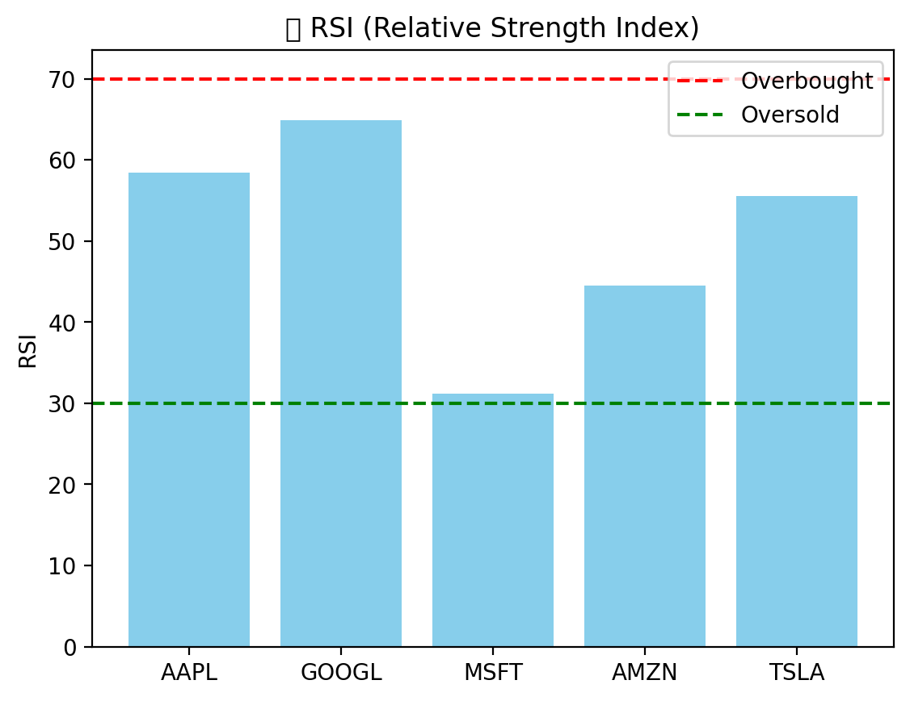
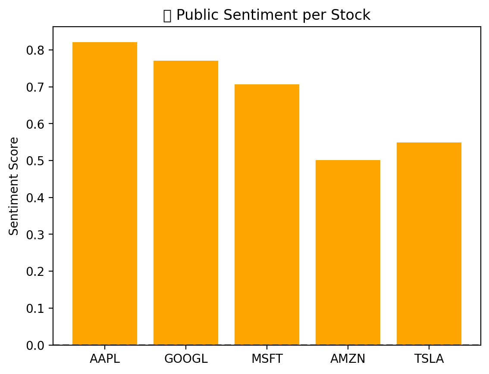

# 🧠 AI Stock Portfolio Recommender

An intelligent stock portfolio recommender system that combines sentiment analysis, technical indicators, and rule-based logic to suggest optimal stock allocations. The app provides interactive visualizations, portfolio scoring, and downloadable performance reports — all in one Streamlit-based interface.

---

## 🚀 Features

- 📊 **Portfolio Scoring** using rule-based logic (MACD, RSI, Sentiment, Returns)
- 🧠 **Sentiment Analysis** from news headlines using VADER
- 📈 **Technical Indicators**: RSI, MACD, Signal Line, 7-day returns & volatility
- 🔁 **Real-Time Data** via `yfinance` API
- 📄 **PDF Report** download with charts and stock summaries
- 🎨 **Interactive Charts** (optional with Plotly)
- ✅ Clean UI with a “Generate Portfolio” button

---

## 📦 Tech Stack

| Component        | Technology         |
|------------------|--------------------|
| Backend Logic    | Python, Pandas, NumPy |
| Sentiment Engine | VADER Sentiment Analysis |
| Data Source      | Yahoo Finance (`yfinance`) |
| Visualization    | Matplotlib / Plotly (optional) |
| Frontend UI      | Streamlit         |
| Report Generator | Matplotlib + FPDF or ReportLab |

---

## 📁 Folder Structure

```
AI-stock-portfolio-recommender/
├── app.py                           # Main Streamlit app
├── part4_generate_portfolio_features.py
├── part5a_rule_based_recommender.py
├── part5b_visualize_portfolio.py   # Static charts
├── report_generator.py             # PDF report creation
├── requirements.txt
└── README.md
```

---

## 🧪 How It Works

1. **Generate Features:** Fetch historical stock data and compute indicators
2. **Score Portfolio:** Apply rule-based logic to rank the top stocks
3. **Visualize Results:** Show allocation, RSI, sentiment, returns, etc.
4. **Download Report:** Export a full summary of the portfolio as a PDF

---

## 🛠️ Setup Instructions

### 1. Clone the Repository

```bash
git clone https://github.com/your-username/AI-stock-portfolio-recommender.git
cd AI-stock-portfolio-recommender
```

### 2. Install Dependencies

```bash
pip install -r requirements.txt
```

### 3. Run the App

```bash
streamlit run app.py
```

---

## 📷 Screenshots

| Portfolio Allocation | RSI Chart | Public Sentiment Per Stock|
|----------------------|-----------|----------------|
|  |  |  |


---

## 📌 Future Improvements

- 🤖 ML-based portfolio scoring using Random Forest/XGBoost
- 🕵️‍♂️ Real-time sentiment streaming (News, Twitter)
- 🧠 Add NLP-powered news summarizer
- 💹 Historical backtesting with Sharpe Ratio & benchmark comparison
- 🔒 User-based login and portfolio saving

---

## 🙌 Acknowledgements

- Yahoo Finance for stock data
- VADER for sentiment scoring
- Streamlit for rapid app deployment

---

## 📬 Contact

**Akshat Choubey**   

---

## 📝 License

MIT License
